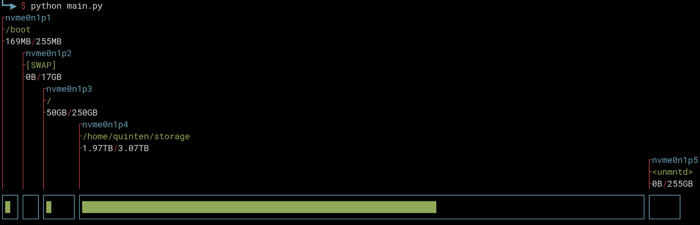

Diskgraph
=========

Usage
-----

Example usage (without color):
```
 $ python main.py
┌nvme0n1p1
├/boot
├169MB/255MB
│   ┌nvme0n1p2
│   ├[SWAP]
│   ├0B/17GB
│   │   ┌nvme0n1p3
│   │   ├/
│   │   ├50GB/250GB
│   │   │      ┌nvme0n1p4
│   │   │      ├/home/quinten/storage
│   │   │      ├1.97TB/3.07TB
│   │   │      │                                                                                                              ┌nvme0n1p5
│   │   │      │                                                                                                              ├<unmntd>
│   │   │      │                                                                                                              ├0B/255GB
┌──┐┌──┐┌─────┐┌─────────────────────────────────────────────────────────────────────────────────────────────────────────────┐┌─────┐
│█ ││  ││█    ││█████████████████████████████████████████████████████████████████████                                        ││     │
└──┘└──┘└─────┘└─────────────────────────────────────────────────────────────────────────────────────────────────────────────┘└─────┘
```

Example screenshot (with color):

